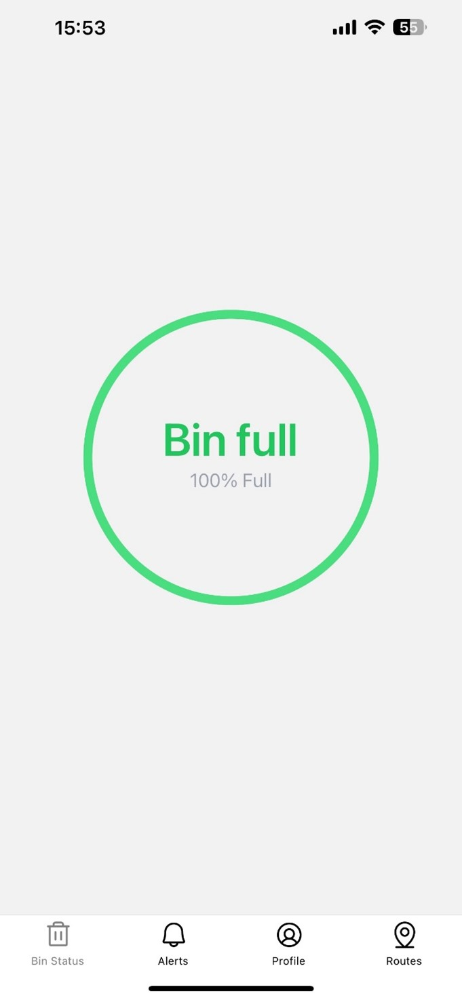
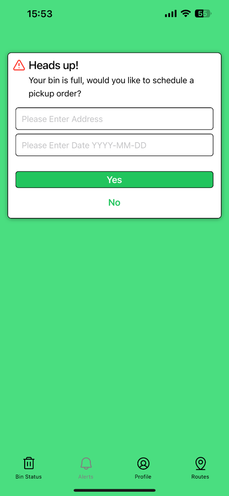
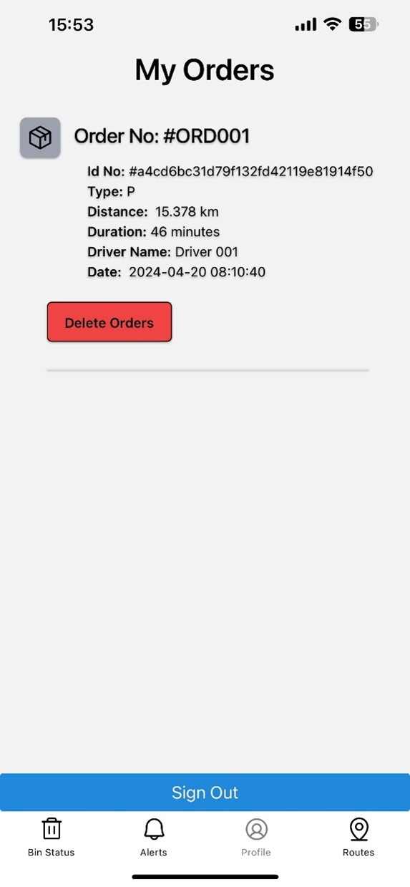
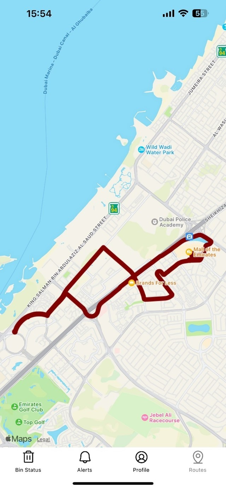

# EcoSortAI

This React native app, works in tandem with the [waste-classification-v2](https://www.github.com/aadil10i/waste-classification-v2) project, to monitor bin status in real-time and create, schedule orders for bin pickups using [optimoroute](https://www.optimoroute.com).

  
  
  
  

